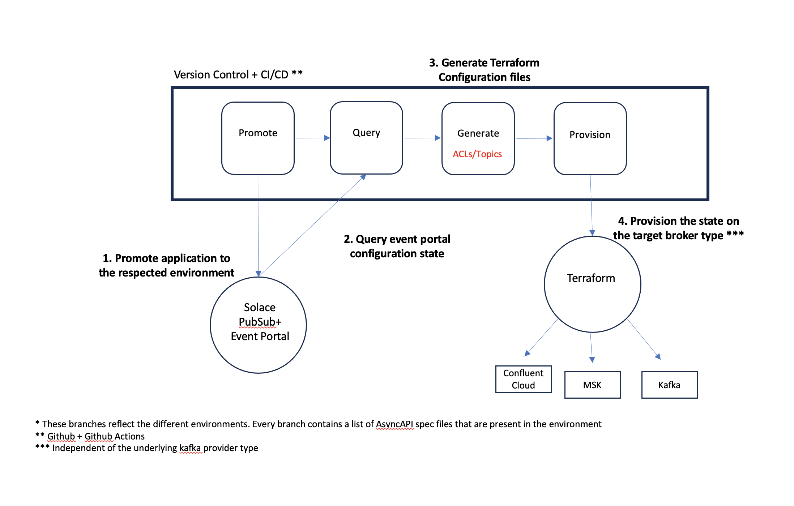

# Solace Terraform Provisioning

This repo contains tools that will enable moving from Solace PubSub+ Event Portal to infrastructure provisioning. The following broker types providers are supported:

1. Confluent Cloud
1. MSK 
1. Vanilla Kafka
1. Solace

## Environment setup

- Node 16+
- Docker v 20.10+

## Providers

Configurations for the following providers are generated: 

1. [Confluent Cloud](https://registry.terraform.io/providers/confluentinc/confluent/latest/docs)
1. [Vanilla Kafka](https://registry.terraform.io/providers/Mongey/kafka/latest/docs)
1. [Solace TelusAg](https://registry.terraform.io/providers/TelusAg/solace/latest)
1. Solace Native

## Prerequisites

Set the following environment variables

| Env variable name  | Required/Optional | Description | Default |
| ------------- | ------------- | ------------- | ------------- |
| `SOLACE_CLOUD_TOKEN`  | Required  | Solace Cloud token | NA |
| `TF_VAR_confluent_cloud_api_key`  | Required  | Confluent cloud API Key | NA |
| `TF_VAR_confluent_cloud_api_secret`  | Required  | Confluent cloud API Secret | NA |
| `AWS_ACCESS_KEY_ID`  | Required  | AWS Key ID | NA |
| `AWS_SECRET_ACCESS_KEY`  | Required  | AWS Access Key | NA |
| `SOLACE_MESSAGING_SERVICE`  | Optional  | The target messaging service to provision | The first messaging service in EP |

- Bucket name `confluent-dynamic-envs` must exist on S3

## Steps
1. `npm i`: install the required dependencies
1. `npm run promote -- -av <applicationVersionID> -mes <TargetMessagingService>`: Promote an application version and all it's associated events to the target messaging service
1. `npm run provision`: Provision the underlying kafka cluster to reflect Solace Pubsub+ Event Portal messaging service configuration

### Tips 

- You can set a different messaging service before running the provisioning script as follows
`SOLACE_MESSAGING_SERVICE="PROD-Kafka" npm run provision`
- Query the EP configuration file by running `npm run config`
- Generate the terraform configuration files by running `npm run generate`

## Note on provisioning steps:
When running `npm run provision`, the following steps happens:
- Query the configuration for the target messaging service from Event Portal and store in [ep-config](./ep-config)
- Generate terraform configuration files for all supported broker providers and store in [terraform-config](./terraform-config)
- Provision the underlying cluster

## Configuration Files

1. `{Messaging_Service}_topic_list_{Broker_Provider_Type}.json` - Contains the list of topics in the target messaging service to be provisioned 
1. `{Messaging_Service}_acl_terraform_{Broker_Provider_Type}.json` - Contains the ACL configuration in HCL format to be provisioned

## Flow

## Todo 
- [ ] Promotion logic to take AsyncAPI spec as parameter instead of applicationID
